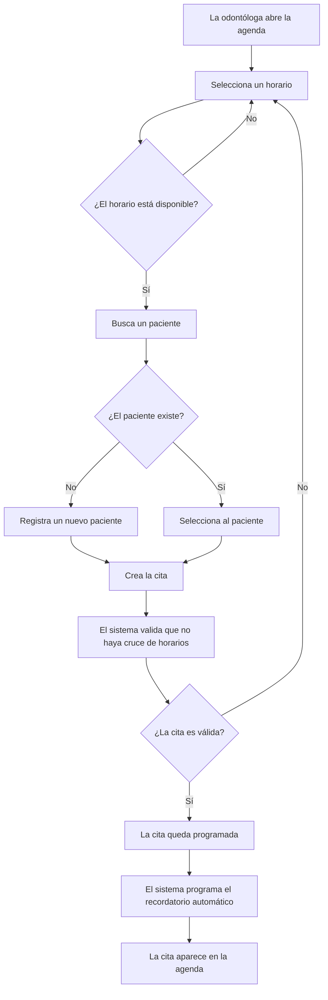

# Flujo de gestión de citas

## Objetivo

Definir cómo la odontóloga crea, consulta, modifica y finaliza una cita dentro de Dental Practice Manager.

Este documento describe el comportamiento del sistema. Los datos exactos solicitados al paciente y los detalles del expediente clínico se definirán posteriormente.

## Flujo principal

## Crear una cita

La odontóloga debe poder:

1. Consultar la agenda y seleccionar una fecha y horario.
2. Verificar que el horario se encuentre disponible.
3. Buscar un paciente ya registrado.
4. Registrar un paciente nuevo si aún no existe.
5. Crear la cita.
6. Confirmar que la cita fue guardada correctamente.
7. Dejar programado el recordatorio automático.

> [!NOTE]
> La duración de una cita y la información adicional requerida se definirán después de validar el proceso real de trabajo de la odontóloga.

## Estados de una cita

Cada cita debe tener un estado para reflejar su situación actual.

| Estado | Descripción |
|---|---|
| Programada | La cita fue creada y está pendiente de realizarse. |
| Confirmada | La asistencia del paciente fue confirmada. |
| Reprogramada | La cita original cambió de fecha u hora. |
| Cancelada | La cita no se realizará. |
| Atendida | La consulta fue realizada. |
| No asistió | El paciente no acudió a la cita. |

## Reprogramar una cita

Cuando la odontóloga necesite cambiar una cita:

1. Selecciona una cita existente.
2. Elige una nueva fecha u horario.
3. El sistema valida que el nuevo horario esté disponible.
4. La cita se actualiza.
5. El recordatorio automático anterior debe actualizarse o cancelarse.
6. Se programa un nuevo recordatorio para la nueva fecha.

## Cancelar una cita

Cuando una cita no se realizará:

1. La odontóloga selecciona la cita.
2. Indica que desea cancelarla.
3. El sistema cambia su estado a **Cancelada**.
4. El sistema cancela los recordatorios pendientes.
5. El horario vuelve a estar disponible.

> [!IMPORTANT]
> Una cita cancelada no debe eliminarse de forma definitiva; debe conservarse para mantener el historial de cambios.

## Finalizar una cita

Después de la hora programada, la odontóloga puede actualizar la cita como:

- **Atendida**, si el paciente acudió.
- **No asistió**, si el paciente no acudió.
- **Reprogramada**, si la atención se movió a otro horario.
- **Cancelada**, si la cita se anuló.

Por ahora, marcar una cita como atendida no implica crear o modificar un expediente clínico. Esa integración se definirá en una fase posterior.

## Reglas de validación

El sistema debe cumplir estas reglas:

| Regla | Comportamiento esperado |
|---|---|
| Evitar cruces | No permitir dos citas activas en el mismo horario. |
| Paciente requerido | Una cita debe estar asociada a un paciente. |
| Fecha válida | No permitir crear citas en fechas u horarios pasados. |
| Estado controlado | Una cita solo puede tener uno de los estados definidos. |
| Recordatorios consistentes | Al reprogramar o cancelar, los recordatorios deben actualizarse o cancelarse. |
| Historial | No eliminar citas canceladas; conservarlas con su estado. |

## Decisiones pendientes

Antes de implementar este flujo deben definirse:

- Duración predeterminada de las citas.
- Horario laboral y días de atención de la odontóloga.
- Tiempo mínimo entre citas.
- Si la odontóloga podrá bloquear espacios personales o no disponibles.
- Canal de envío de recordatorios automáticos.
- Tiempo de anticipación para cada recordatorio.
- Proceso para confirmar una cita desde el recordatorio.
